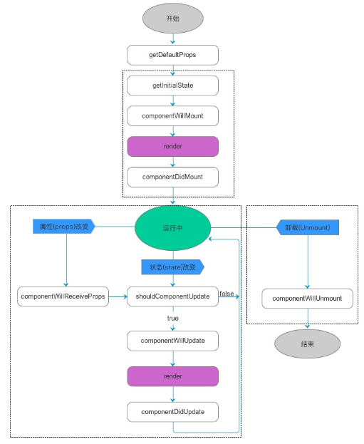

# React-Native 实现原理

## RN 生命周期

* getDefaultProps：

在组件创建之前，会先调用 getDefaultProps()，这是全局调用一次。
* getInitialState()，来初始化组件的状态。

* componentWillMount：准备开始加载组件。
在整个生命周期中只被调用一次，可以在这里做一些业务初始化操作，也可以设置组件状态。

* componentDidMount：组件第一次绘制之后调用。
此时，其虚拟DOM已经构建完成，可以在这时候中开始获取其中的元素或者子组件了。
需要注意的是，RN 框架是先调用子组件的componentDidMount()，然后调用父组件的函数。
从这个函数开始，就可以和 JS 其他框架交互了，例如设置计时setTimeout 或发起网络请求。

* componentWillReceiveProps：
如果组件收到新的props，就会调用，在这个回调函数里面，你可以根据属性的变化，通过调用 this.setState()来更新你的组件状态，这里调用并不会触发额外的 render() 调用。

* shouldComponentUpdate：当组件接收到新的属性和状态改变的话，都会触发调用

* componentWillUpdate：
如果shouldComponentUpdate(…) 返回为true，就会开始准备更新组件，
在这个函数里面，不能调用this.setState 来修改状态。

* 紧接着这个函数，就会调用 render() 来更新界面了

* componentDidUpdate：

调用了 render() 更新完成界面之后，会调用 componentDidUpdate()来得到通知。

* componentWillUnmount

当组件要被从界面上移除的时候，就会调用componentWillUnmount()。在这个函数中，可以做一些组件相关的清理工作，例如取消计时器、网络请求等。

