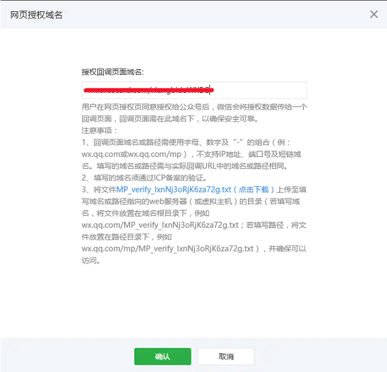

# 微信公众号支付


## 实现支付功能前提

* 1，开通微信支付功能

* 2，获取open ID 

    * 配置授权域名
    
微信对于这个微信用户访问的三方页面的授权是通过OAuth2.0鉴权的。若是需要在网页中授权操作，那么需要填写配置授权回调域名。
仅仅是填写一个不带http或者https的域名字符串 例如：www.baidu.com
该授权回调域名会在下面的网页授权过程中，重定向的时候进行域名校验。若是不填写，或者填写有误，则网页授权接口调用会失败。
    
 
   
   * 获取code
   
   必须是在微信客户端，引导微信用户访问下面文档指定的url。注意，我们可以修改的仅仅是接口中重定向redirect_uri部分，可以重定向到我们自己开发的页面中。
   这里要注意的是 
   
   **这个重定向的url,跳转回调redirect_uri必须要经过URLEncoder编码**
   
   *  获取openID
   
 通过code值和appid,secret发送了一个http请求，用于获取用户的openId,
    
 请求成功返回如下格式内容:
```markdown
{
   "access_token":"ACCESS_TOKEN",
   "expires_in":7200,
   "refresh_token":"REFRESH_TOKEN",
   "openid":"OPENID",
   "scope":"SCOPE"
}
```

* 3，下单

    通过服务端，调用下单接口，返回支付信息
 ```markdown
"appId": "wx2421b1c4370ec43b",
//公众号名称，由商户传入     
"timeStamp": "1395712654",
//时间戳，自1970年以来的秒数     
"nonceStr": "e61463f8efa94090b1f366cccfbbb444",
//随机串     
"package": "prepay_id=up_wx21201855730335ac86f8c43d1889123400",
"signType": "RSA",
//微信签名方式：     
"paySign": "oR9d8PuhnIc+YZ8cBHFCwfgpaK9gd7vaRvkYD7rthRAZ\/X+QBhcCYL21N7cHCTUxbQ+EAt6Uy+lwSN22f5YZvI45MLko8Pfso0jm46v5hqcVwrk6uddkGuT+Cdvu4WBqDzaDjnNa5UK3GfE1Wfl2gHxIIY5lLdUgWFts17D4WuolLLkiFZV+JSHMvH7eaLdT9N5GBovBwu5yYKUR7skR8Fu+LozcSqQixnlEZUfyE55feLOQTUYzLmR9pNtPbPsu6WVhbNHMS3Ss2+AehHvz+n64GDmXxbX++IOBvm2olHu3PsOUGRwhudhVf7UcGcunXt8cqNjKNqZLhLw4jq\/xDg==" //微信签名 

```
    
    
 ## 支付
 
 ```markdown

 WeixinJSBridge.invoke('getBrandWCPayRequest', {
        "appId": "wx2421b1c4370ec43b",
        //公众号名称，由商户传入     
        "timeStamp": "1395712654",
        //时间戳，自1970年以来的秒数     
        "nonceStr": "e61463f8efa94090b1f366cccfbbb444",
        //随机串     
        "package": "prepay_id=up_wx21201855730335ac86f8c43d1889123400",
        "signType": "RSA",
        //微信签名方式：     
        "paySign": "oR9d8PuhnIc+YZ8cBHFCwfgpaK9gd7vaRvkYD7rthRAZ\/X+QBhcCYL21N7cHCTUxbQ+EAt6Uy+lwSN22f5YZvI45MLko8Pfso0jm46v5hqcVwrk6uddkGuT+Cdvu4WBqDzaDjnNa5UK3GfE1Wfl2gHxIIY5lLdUgWFts17D4WuolLLkiFZV+JSHMvH7eaLdT9N5GBovBwu5yYKUR7skR8Fu+LozcSqQixnlEZUfyE55feLOQTUYzLmR9pNtPbPsu6WVhbNHMS3Ss2+AehHvz+n64GDmXxbX++IOBvm2olHu3PsOUGRwhudhVf7UcGcunXt8cqNjKNqZLhLw4jq\/xDg==" //微信签名 
    },
    function(res) {
        if (res.err_msg == "get_brand_wcpay_request:ok") {
            // 使用以上方式判断前端返回,微信团队郑重提示：
            //res.err_msg将在用户支付成功后返回ok，但并不保证它绝对可靠。
        }
    });
}
if (typeof WeixinJSBridge == "undefined") {
    if (document.addEventListener) {
        document.addEventListener('WeixinJSBridgeReady', onBridgeReady, false);
    } else if (document.attachEvent) {
        document.attachEvent('WeixinJSBridgeReady', onBridgeReady);
        document.attachEvent('onWeixinJSBridgeReady', onBridgeReady);
    }
} else {
    onBridgeReady();
}
```