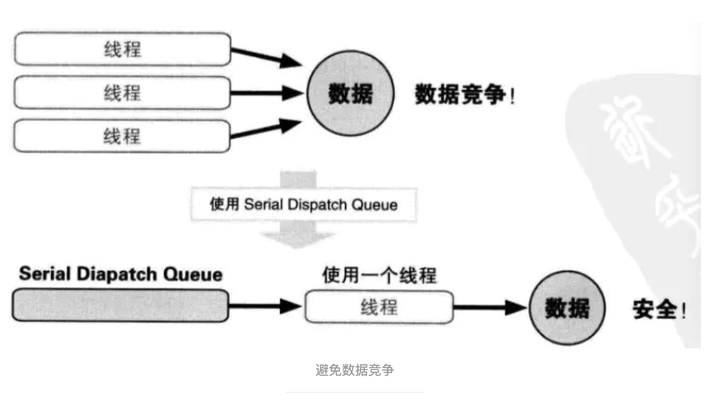
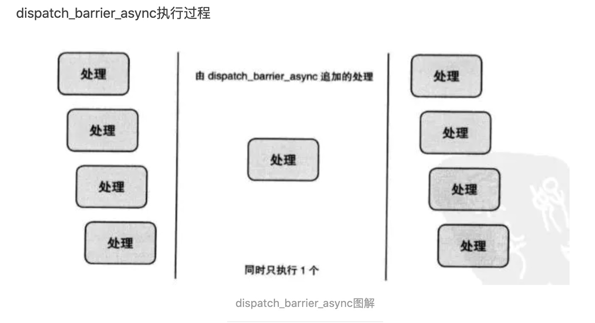

# 第一章自动引用计数
## 1.1自动引用计数
自动引用计数，即内存管理中对引用自动计数的技术

## 1.2内存管理

### 1.2.1内存管理的四个原则：

* 自己生成的对象，自己持有（初始化）
    
    alloc/new/copy/mutableCopy
* 非自己生成的对象，自己也能持有（）
   
    除以上方法以外生成的对象
    
    id obj = NSMutableArray array]//取得对象存在，但不持有对象
    
    [obj reatain] //通过retain 方法持有
    

* 不再需要自己持有的对象时释放
    
    不再使用时，release

* 非自己持有的对象无法释放
    
    程序如果释放非自己持有的对象，会导致程序奔溃
    
### 1.2.2 MRC情况下

    使用alloc 或retain方法后，引用计数+1
    调用release后，-1
    归0时，调用dealloc 废弃对象
    
    
### 1.2.3 autorelease
    
    超出变量作用域后，自动废弃
    
    在产生大量autorelease对象是，只要不废弃NSAutoreleasePool生成的对象就不会释放，需要咋适当的地方生成，持有或者废弃。
    （[pool drain]== [pool release]）


## 1.3ARC规则

### 1.3.1

    指定ARC 有效，编译器属性为 "-fobjc-arc"

    id 类型和对象默认所有权案修饰符是__strong
    
* 循环引用，容易发生内存泄露，所谓内存泄露就是应到废弃的对象在超出其生存周期后继续存在。

* __weak 弱引用不持有对象实例，可避免循环引用。在超出其变量作用域时，即被释放。
在持有某对象的弱引用时，若对象被废弃，则此弱引用将自动失效，且被赋值为nil

* 如果直接使用 weak 修饰符修饰生成的变量，对象会被立即释放。因此将生成对象赋给strong修饰符的变量，然后再赋给weak修饰符的变量。
    
* 在ARC情况下，@autoreleasepool来代替 NSAutoreleasePool

* 对象类型的变量，不能作为C语言结构体的成员

* 不要显式调用dealloc

* 显式转换 id 和 void * 通过 __bridge 转换


## 1.4ARC实现


属性声明中，copy retain strong 的修饰符为__strong
         unsafe_unretained、 assign 为 __unsafe_unretained
         weak 为__weak
         
弱引用不持有对象，所以引用计数器不改变

__autoreleasing 修饰符，注册到autoreleasepool中计数器+1


# 二、blocks

## 2.1blocks

blocks ：带有自动变量（局部变量）的匿名函数

* block 类型

根据存放区来区分：

    __NSGlobalBlock__类型的block，因为这样使用block并没有什么意义。直到程序结束才会被回收，不过我们很少使用到

    __NSStackBlock__类型的block存放在栈中，我们知道栈中的内存由系统自动分配和释放，作用域执行完毕之后就会被立即释放，而在相同的作用域中定义block并且调用block似乎也多此一举。

    __NSMallocBlock__是在平时编码过程中最常使用到的。存放在堆中需要我们自己进行内存管理。


## 2.2blocks模式

* block 语法：
        
      ^ 返回值类型  参数列表  表达式
      ^           参数列表  表达式   
      ^                    表达式

   返回值类型与参数列表是可以省略的

* block 类型变量
    
      int (^blk)(int)
      返回类型（^变量名称）(参数列表类型)
   
   block类型变量可以作为函数参数使用
   
   block 可以作为函数返回值使用
   
* typedef 声明block

      typedef int (^blk_t)(int)


block 执行时自动变量的值，是其声明时的值。即保存自动变量的瞬间值

block 不能改变在语法外声明的变量的值，如需改变，在该变量前附加__block 说明符，称为__block 变量


## 2.3blocks实现

block 是带有自动变量值的匿名函数

block 实际上是OC的对象，内部实现是以结构体的形式存储实现的。

block 语法表达式中的自动变量会被作为成员变量追加到block的 结构体中

__block 修饰符修饰的变量，转换成源码会变成结构体实例

Block 实质是栈上Block的结构体实例

__block 变量，实质是栈上__block 变量的结构体实例

设置在栈上的Block 和__block 变量，如果其所属的变量作用域结束，会被废弃。
如果想要在变量作用域外安全的适用，可以将其从栈上复制到堆上来使用。栈上结束了，堆上还可以继续使用。

当ARC 有效时，编译器会自动生成将block 从栈上复制到堆上的代码，手动复制的话，调用copy

* 什么时候栈上的block 会复制到堆上呢？

    * 调用Block 的copy方法时
    * Block 作为函数返回值返回时
    * 将block 赋值给附有 __strong 修饰符id 类型的类或者Block类型成员变量时
    * 方法命中含有UsingBlock 的Cocoa框架方法或者GCD的API中传递Block时
    
     
通过使用附有__strong 修饰符的自动变量，block 中截获的对象就能够超出其变量作用域而存在。

* 循环引用
   
   当block中使用附有__strong 修饰符的对象类型自动变量，当Block 从栈复制到堆时，该对象为Block所持有。
   容易引起循环引用。
   
   * 可使用__weak 修饰符声明一个变量，将要引用的变量赋值给次weak变量，可以避免循环引用，但同时需注意，__weak变量没有被引用容易直接被释放
   需声明一个__strong 修饰符的对象来避免被释放。（容易引起悬垂指针）
    
   **如果block中引用了对象属性，则同时也截获了self，也会引起循环引用**
   
   * 还可以使用 __block 变量来避免循环引用。
     * 在Block 中将__block 变量置为nil
     * Block 必须执行，否则同样会引起循环引用。
     
     
* block的变量捕获

局部变量因为跨函数访问所以需要捕获，全局变量在哪里都可以访问 ，所以不用捕获。

局部变量都会被block捕获，自动变量是值捕获，静态变量为地址捕获。全局变量则不会被block捕获
 


# 三 Grand Central Dispatch(GCD)

## 3.1 GCD

开发者要做的只是定义想执行的任务并追加到适当的Dispatch Queue中。

```
dispatch_asyn(queue, ^{
  //想要执行的任务
});
```
* Dispatch Queue种类	说明

    * Serial Dispatch Queue	等待现在执行中处理结束
    
    假设把A B C D四个任务依次加入到一个Serial Dispatch Queue中，这个Serial Dispatch Queue会创建一个线程，依次执行这四个任务。

    * Concurrent Dispatch Queue	不等待现在执行中处理
    
    假设把A B C D四个任务依次加入到一个Concurrent Dispatch Queue中，这个Concurrent Dispatch Queue会创建多个线程，并发执行这四个任务。


## 3.2 API

### 创建一个线程（dispatch_queue_create）

* 创建Serail Queue:
```
dispatch_queue_t mySerailQueue = dispatch_queue_create("com.river.dispatchSerailQueue", NULL)

```
* 创建Concurrent Queue:

```
dispatch_queue_t myConcurrentQueue = dispatch_queue_create("com.river.dispatchConcurrentQueue", DISPATCH_QUEUE_CONCURRENT)
```

第一个参数是指定Serial dispatch queue的名称。该名称在Xcode和Instruments的调试器中作为Dispatch Queue名称表示。

第二个参数是生成Dispatch Queue的类型，如果是NULL生成Serial dispatch queue，指定为DISPATCH_QUEUE_CONCURRENT生成Concurrent Dispatch Queue。

尽可能，只使用一个线程，在一个线程内使用一个队列。生成太多的Serial Dispatch Queue会消耗大量内存




### 获取一个线程队列（Main Dispatch Queue/Global Dispatch Queue）

Main Dispatch Queue是在主线程执行的dispatch queue, Main Dispatch Queue是一个Serail Dispatch Queue，在主线程的RunLoop中执行

Global Dispatch Queue是所有应用程序都能过使用的Concurrent Dispatch Queue。没有必要通过dispatch_queue_create函数逐个创建Concurrent Dispatch Queue，只要获取Global Dispatch Queue使用即可

* 获取方式：
```
    //Main Dispatch Queue
    dispatch_queue_t mainDispatchQueue = dispatch_get_main_queue();

    //Global Dispatch Queue
    dispatch_queue_t globalDispatchQueueHigh = dispatch_get_global_queue(DISPATCH_QUEUE_PRIORITY_HIGH, 0);
    dispatch_queue_t globalDispatchQueueDefault = dispatch_get_global_queue(DISPATCH_QUEUE_PRIORITY_DEFAULT, 0);
    dispatch_queue_t globalDispatchQueueLow = dispatch_get_global_queue(DISPATCH_QUEUE_PRIORITY_LOW, 0);
    dispatch_queue_t globalDispatchQueueBackground = dispatch_get_global_queue(DISPATCH_QUEUE_PRIORITY_BACKGROUND, 0);
```

* 使用方法

```
    dispatch_async(dispatch_get_global_queue(DISPATCH_QUEUE_PRIORITY_DEFAULT, 0), ^{
        /**
         *  可并行处理的任务TODO
         */
        dispatch_async(dispatch_get_main_queue(), ^{
            /**
             *  主线程执行
             */
        });
    });
```


### 设置线程优先级（dispatch_set_target_queue）

dispatch_queue_create函数生成的Dispatch_Queue不管是Serial Dispatch Queue还是Concurrent Dispatch Queue都使用与 **默认优先级
Global Dispatch Queue** 相同执行优先级的线程。

```
dispatch_queue_t mySerialDispatchQueue = dispatch_queue_create("com.river.myserialdispatchqueue", NULL);
dispatch_queue_t globalDispatchQueueBackGround = dispatch_get_global_queue(DISPATCH_QUEUE_PRIORITY_BACKGROUND, 0);
dispatch_set_target_queue(mySerialDispatchQueue, globalDispatchQueueBackGround);
```
第一个参数：队列，要变更执行优先级的Dispatch Queue

第二个参数：优先级，即要使用的执行优先级相同的Global Dispatch Queue。

如果指定第一个参数为Main Dispatch Queue 和 Global Dispatch Queue则不知道会发生什么情况。

如果在多个Serial Dispatch Queue 中将一个Serial Dispatch Queue设置为第二个参数，那么原本应该并行执行的Serial Dispatch Queue，在目标Serial Dispatch Queue上只能串行执行

### dispatch_after

dispatch_after表示在指定的时间之后追加处理到Dispatch Queue。

**并不是指定时间后执行处理**

```
dispatch_time_t time = dispatch_time(DISPATCH_TIME_NOW, 3ull*NSEC_PER_SEC);
dispatch_after(time, dispatch_get_main_queue(), ^{
        NSLog(@"等待3秒后执行");
 });
```

虽然在有严格时间到要求下使用时会出现问题，但在大致延迟执行处理时，该函数还是有效的。

dispatch_time函数通常用于计算相对时间，而dispatch_walltime函数用于计算绝对时间。


* NSDate转成dispatch_time_t

```
- (dispatch_time_t) getDispatchDateByDate:(NSDate *)date{
    NSTimeInterval interval;
    double second, subsecond;
    struct timespec time;
    dispatch_time_t milestone;

    //以当前时间(Now)为基准时间，返回实例保存的时间与当前时间(Now)的时间间隔，秒
    interval = [date timeIntervalSince1970];
    //拆分interval值,返回它的小数部分,second指向整数部分
    subsecond = modf(interval, &second);
    time.tv_sec = second;   //秒
    time.tv_nsec = subsecond *NSEC_PER_SEC; //纳秒 1秒＝1000000000纳秒
    milestone = dispatch_walltime(&time, 0);
    return milestone;
}
```

### Dispatch Group

当在追加到Dispatch Queue中的多个处理全部结束后想执行结束处理操作，但业务线程如果为多个串行队列，或者是多个并行队列。代码会很复杂

在这种情况下使用Dispatch Group。

将多个队列加入到同一个group 中，在group中所有都执行结束时，执行dispatch_group_notify

```markdown
    //并行队列
    dispatch_queue_t queue = dispatch_get_global_queue(DISPATCH_QUEUE_PRIORITY_DEFAULT, 0);
    dispatch_group_t group = dispatch_group_create();
    dispatch_group_async(group, queue, ^{
        for (int i=0; i<2000; i++) {
            NSLog(@"111111");
        }
    });
    dispatch_group_async(group, queue, ^{
        for (int i=0; i<2000; i++) {
            NSLog(@"2222222");
        }
    });
    dispatch_group_async(group, queue, ^{
        for (int i=0; i<2000; i++) {
            NSLog(@"33333");
        }
    });
    //最后执行4444
    dispatch_group_notify(group, dispatch_get_main_queue(), ^{
        NSLog(@"44444");
    });
    NSLog(@"555555");
```

另外，在Dispatch Group中也可以使用dispatch_group_wait
dispatch_group_wait函数的第二个参数指定为等待的时间，它属于dispatch_time_t类型的值

```markdown
    dispatch_time_t time = dispatch_time(DISPATCH_TIME_NOW, 1ull*NSEC_PER_SEC);
    //等待group中的队列time时间，返回结果
    long result = dispatch_group_wait(group, time);
    if (result == 0) {
        /**
         *属于dispatch group的任务全部执行完毕
         */
    }else {
        /**
         *属于dispatch group的任务没有全部执行完毕
         */
    }
```

**注意推荐使用dispatch_group_notify**

### dispatch_barrier_async

dispatch_barrier_async函数会等待追加到Concurrent Dispatch Queue上对并行执行的处理全部结束之后，再将指定的处理追加到
该Concurrent Dispatch Queue中，然后在由dispatch_barrier_async函数追加的处理执行完毕之后，Concurrent Dispatch Queue才会恢复一般动作。

```markdown

    dispatch_async(queue, ^{
        //读文件
    });
    dispatch_async(queue, ^{
        //读文件
    });
    dispatch_async(queue, ^{
        //读文件
    });
    //使用dispatch_barrier_async避免数据竞争
    dispatch_barrier_async(queue, ^{
        //写文件
    });
    dispatch_async(queue, ^{
        //读文件
    });
    dispatch_async(queue, ^{
        //读文件
    });

    dispatch_async(queue, ^{
        //读文件
    });
```



### dispatch_sync 同步

dispatch_sync函数意味着同步，也就是将指定的Block同步追加到Dispatch Queue中，再追加结束之前dispatch_sync函数会一直等待

容易引起死锁

**谨慎使用**

### dispatch_apply

dispatch_apply函数是dispatch_sync函数和Dispatch Group的关联API。该函数按指定的次数将指定的Block追加到Dispatch Queue中，并等待全部处理执行结束。

```markdown
    dispatch_queue_t queue = dispatch_get_global_queue(DISPATCH_QUEUE_PRIORITY_DEFAULT, 0);
    dispatch_apply(10, queue, ^(size_t index) {
        NSLog(@"%zu", index);//并行
    });
    //最后执行
    NSLog(@"11");
    
    对数组的快速处理：
    
    dispatch_queue_t queue = dispatch_get_global_queue(DISPATCH_QUEUE_PRIORITY_DEFAULT, 0);
    dispatch_apply([array count], queue, ^(size_t index) {
        NSLog(@"%zu:%@", index, [array objectAtIndex:index]);
    });
```

推荐dispatch_async函数非同步地执行dispatch_apply函数

```markdown
  dispatch_async(queue, ^{
        dispatch_apply([array count], queue, ^(size_t index) {
            /**
             *  并行执行
             */
            NSLog(@"%zu:%@", index, [array objectAtIndex:index]);
        });

        /**
         *  等待dispatch_apply全部处理完
         */

        dispatch_async(dispatch_get_main_queue(), ^{
            /**
             *  在main dispatch queue中执行，用户界面更新等
             */
            NSLog(@"done");
        });

    });
```

### dispatch_suspend/dispatch_resume

dispatch_suspend 函数挂起指定的Dispatch Queue

dispatch_resume 函数恢复指定的Dispatch Queue

这些函数对已经执行的处理没有影响，挂起后，追加到Dispatch Queue中处理在此之后暂停执行，而恢复使得这些处理继续执行。

### Dispatch Semaphore

Dispatch Semaphore 是持有计数的信号器。


* 初始创建 semaphore为1
```markdown
dispatch_semaphore_t semaphore = dispatch_semaphore_create(1);
//
```
* dispatch_semaphore_wait

dispatch_semaphore_wait函数等待Dispatch Semaphore 的计数值达到大于或等于1。当计数值大于等于1，或者在待机中计数值大于等于1时，对该计数进行减法并从dispatch_semaphore_wait函数返回。
包含以下操作：

   * 判断是否>=1
   * -1
   * 返回

```markdown
dispatch_semaphore_wait(semaphore, DISPATCH_TIME_FOREVER);
等待并判断semaphore是否大于等于1，如果大于等于1才会返回，小于或者为0时，是不返回的。
如满足条件，semaphore为减1，返回
```
通过dispatch_semaphore_signal函数将Dispatch Semaphore的计数值加1。
```markdown
dispatch_semaphore_signal(semaphore);
```

使用示例：
```markdown
    dispatch_queue_t queue = dispatch_get_global_queue(DISPATCH_QUEUE_PRIORITY_DEFAULT, 0);
    
    /**
     * 生成Dispatch Semaphore
     * Dispatch Semaphore 的计数初始值设定为1
     * 保证可访问NSMutableArray类对象的线程同时只有一个
     */
    dispatch_semaphore_t semaphore = dispatch_semaphore_create(1);
    NSMutableArray *array = [[NSMutableArray alloc] init];
    
    for (int i=0; i<10000; i++) {
        dispatch_async(queue, ^{
            /**
             *  等待Dispatch Semaphore
                一直等待，直到Dispatch Semaphore 的计数的值达到大于等于1
             */
            dispatch_semaphore_wait(semaphore, DISPATCH_TIME_FOREVER);
            
            /**
             *  由于Dispatch Semaphore 的计数达到大于等于1
             所以Dispatch Semaphore 的计数值减去1
             dispatch_semaphore_wait函数执行返回
             
             即执行到此时Dispatch Semaphore的计数值恒为00
             
             由于可访问NSMutableArray类对象的线程数只有1个
             因此可安全的进行更新
             */
            [array addObject:[NSNumber numberWithInt:i]];
            
            /**
             * 排他控制处理结束
             所以通过dispatch_semaphore_signal函数
             将DispatchSemaphore的计数值加1
             如果有通过dispatch_semaphore_wait函数
             等待Dispatch Semaphore的计数值增加的线程
             就由最先等待的线程执行。
             */
            dispatch_semaphore_signal(semaphore);
        });
    }
```

### dispatch_once

dispatch_once 函数保证在应用程序执行中只执行一次指定处理的API。

下面这种经常出现的用来初始化的源代码可通过dispatch_oce函数简化

```markdown
static int initialized = NO;
if(initialized == NO){
  initialized = YES;
}

//使用dispatch_once
static disptach_once_t pred;
dispatch_once(&pred, ^{
  //初始化
});
该代码再多线程环境下也是百分之百安全
```

### Dispatch I/O

在读取大文件时，如果将文件分成合适的大小并使用Global Dispatch Queue并列读取的话，应该会比一般的读取速度快不少。实现这一功能可使用Dispatch I/O和Dispatch Data。

通过dispatch I/O读写文件时，使用Global Dispatch Queue将一个文件按某个大笑read/write.

```markdown
pipe_q = dispatch_queue_create("PipeQ", NULL);
pipe_channel = dispatch_io_create(DISPATCH_IO_STREAM, fd, pipe_q, ^(int err){
    close(fd);
});
*out_fd = fdpair[1];
dispatch_io_set_low_water(pipe_channel, SIZE_MAX);
dispatch_io_read(pipe_channel, 0, SIZE_MAX, pipe_q, ^(bool done, dispatch_data_t pipedata, int err){
    if (err == 0)
    {
        size_t len = dispatch_data_get_size(pipedata);
        if (len > 0)
        {
            const char *bytes = NULL;
            char *encoded;
            uint32_t eval;
            
            dispatch_data_t md = dispatch_data_create_map(pipedata, (const void **)&bytes, &len);
            encoded = asl_core_encode_buffer(bytes, len);
            asl_msg_set_key_val(aux, ASL_KEY_AUX_DATA, encoded);
            free(encoded);
            eval = _asl_evaluate_send(NULL, (aslmsg)aux, -1);
            _asl_send_message(NULL, eval, aux, NULL);
            asl_msg_release(aux);
            dispatch_release(md);
        }
    }
  if (done)
    {
        dispatch_semaphore_signal(sem);
        dispatch_release(pipe_channel);
        dispatch_release(pipe_q);
    }
});
```


## 3.3 GCD 实现
